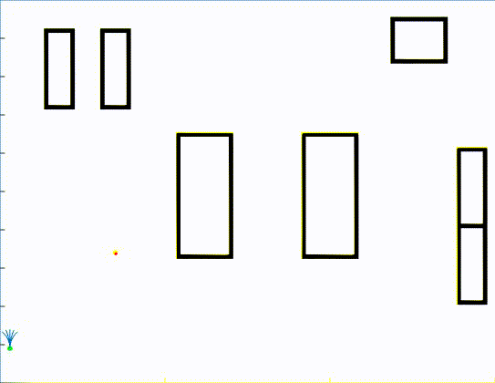

# A-Star_Algorithm

This repository shows the implementation of A* algorithm on differential drive robot (Considering the non-holonomic constraints). The arena used is same as used for the implementation of BFS algorithm.

The result is as follows:

